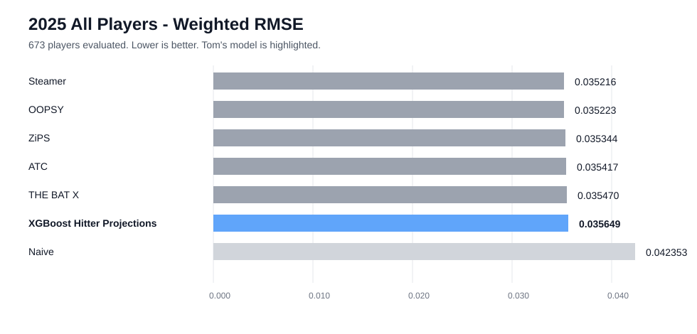
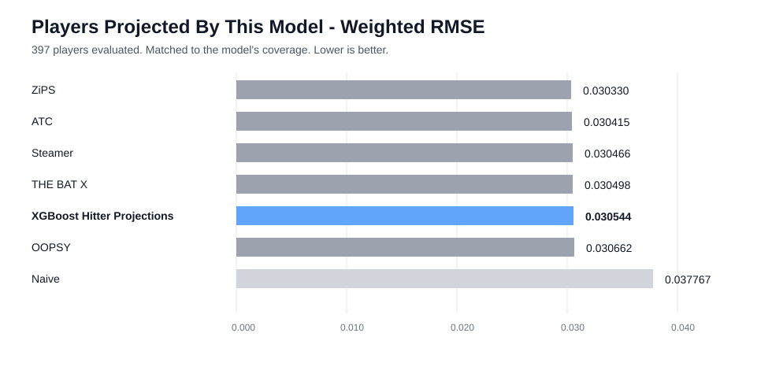
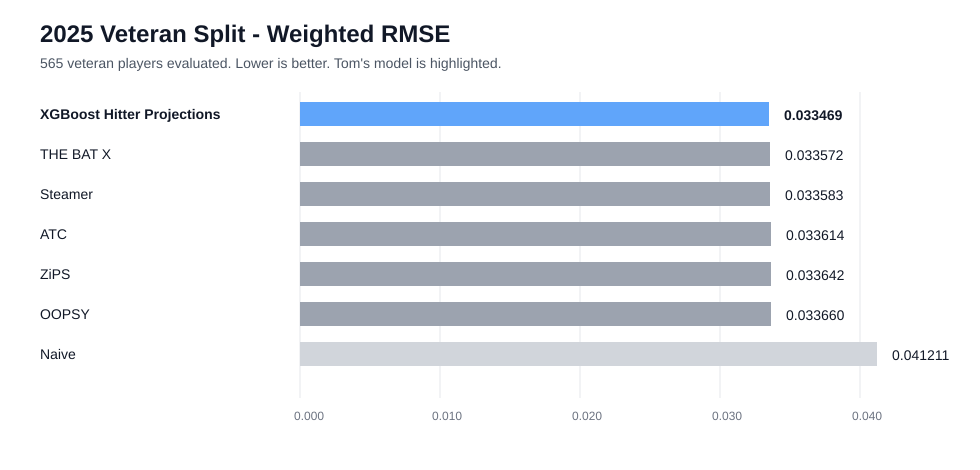
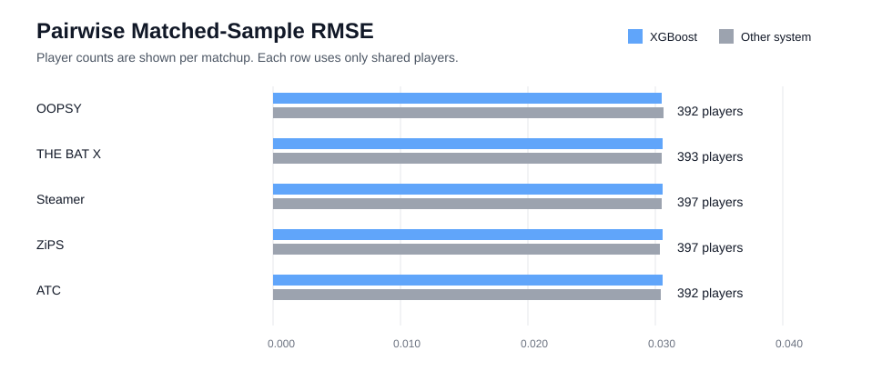
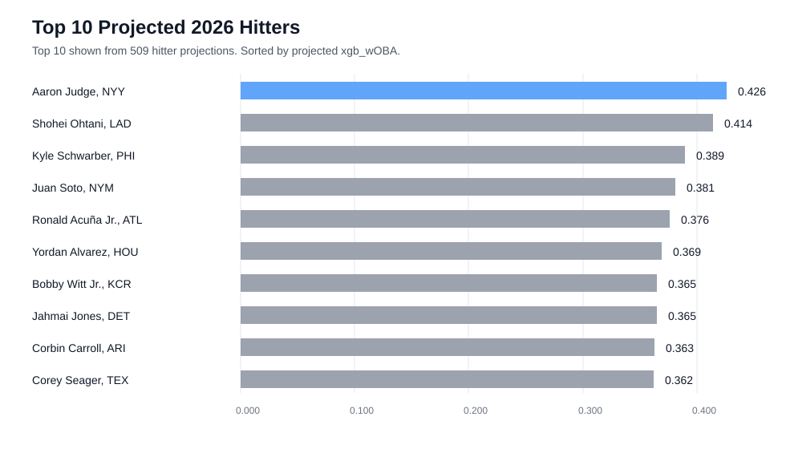

# Baseball Projection System

This is a baseball projections system for hitters using wOBA as the main evaluation metric. The goal of this project is to create a projection system that compared to the best publicaly available systems like Steamer, ZiPS, ATC, THE BAT X, and OOPSY.

The current flagship workflow is an XGBoost hitter model. It projects the components of wOBA, converts those component rates into a final `xgb_wOBA`, and evaluates the result with playing-time-weighted RMSE.

## Current 2025 Results

The table below comes from the local 2025 evaluation using actual 2025 hitter results. Lower weighted RMSE is better.

### All Players



Summary: Steamer led the all-player board at `0.035216` weighted RMSE, while this model finished close behind the public systems at `0.035655` and stayed well ahead of the naive baseline.

### Players Projected By This Model

This is the cleanest apples-to-apples view for the model's own coverage.



Summary: On the model's own projected-player sample, the public systems and XGBoost model are tightly packed, with XGBoost at `0.030544` weighted RMSE.

### Veteran Split

This is where the current model shines. Among non-rookies, it finished first in this evaluation run.



Summary: On veterans, the XGBoost model ranked first at `0.033469` weighted RMSE, narrowly edging THE BAT X, Steamer, ATC, ZiPS, and OOPSY.

### Pairwise Matched Samples

These checks compare only players shared by Tom's model and each public system.



Summary: Matched samples show the model is in the same accuracy band as the public systems, beating OOPSY on the shared-player comparison and trailing the others by small margins.

## Top 10 Projected 2026 Hitters

Sorted by projected `xgb_wOBA` from `projection_systems/hitters/2026/toms_hitter_projections_2026.csv`.



Summary: Aaron Judge leads the model's 2026 hitter board at `0.432` projected `xgb_wOBA`, followed by Shohei Ohtani and Kyle Schwarber.

## How The Hitter Model Works

The model is built around a simple idea: project the ingredients of hitter production, then assemble them into wOBA.

1. Load FanGraphs-style historical batting data.
2. Build one-, two-, and three-year lag features for each player.
3. Create Marcel-style baseline rates using weighted recent history, league regression, and age adjustment.
4. Train separate XGBoost regressors for each wOBA component:
   `HR`, `1B`, `2B`, `3B`, `BB`, `IBB`, `SF`, `SH`, `HBP`, and `SO`.
5. Split players by historical playing time so lower-history and higher-history hitters can use slightly different feature sets.
6. Convert predicted component rates into `xgb_wOBA` using the configured wOBA weights.
7. Export a clean projection file with projected PA, projected wOBA, component rates, and counting-stat estimates.

The model does not directly predict wOBA as one black-box target. It predicts the events that create wOBA, which makes the output easier to inspect and gives the projection file more useful downstream columns.

## How Evaluation Works

The evaluation script is intentionally strict about comparing systems on the same scale.

- Actual 2025 wOBA and PA are loaded from local FanGraphs data.
- Public systems are loaded from `projection_systems/hitters/2025/`.
- Player IDs are matched through cached FanGraphs/MLBAM mappings in `data/cache/mlbam_id_cache.csv`.
- Each projection system is rescaled to the actual league-average wOBA environment.
- Accuracy is scored with PA-weighted RMSE, so missing badly on a full-time hitter matters more than missing on a short playing-time player.
- Missing projections are filled with a tested naive value so systems are not silently rewarded or punished only because of coverage.
- Results are shown for all players, this model's projected-player sample, rookies, veterans, and pairwise matched samples.

`Better Than Naive` is the RMSE improvement over a league-average baseline, expressed on the same wOBA-error scale. Positive is good.

## Quick Start

Follow these steps from a fresh checkout.

### 1. Clone the repo

```powershell
git clone <your-repo-url>
cd baseball_projection
```

### 2. Create a Python environment

Python 3.12 or newer is recommended.

```powershell
python -m venv .venv
.\.venv\Scripts\Activate.ps1
python -m pip install --upgrade pip
```

### 3. Install dependencies

```powershell
python -m pip install pandas numpy xgboost pyarrow pybaseball
```

`pybaseball` is optional for the default local evaluation path, but useful if you want live FanGraphs/player-ID lookups later.

### 4. Confirm the expected data is present

The hitter model and evaluator expect these local files:

```text
data/raw/fangraphs/batting_actuals_2018_2025_qual1.csv
data/raw/fangraphs/batting_actuals_2025_qual1.csv
data/cache/mlbam_id_cache.csv
projection_systems/hitters/2025/*.csv
```

For a future-season projection, the model also uses:

```text
projection_systems/hitters/2026/Depth Charts 2026.csv
```

### 5. Build hitter projections

```powershell
python model_building_and_testing/model_development/hitter_model.py
```

By default, the script builds 2025 hitter projections and writes:

```text
projection_systems/hitters/2025/toms_hitter_projections_2025.csv
```

The main settings live near the top of [hitter_model.py](model_building_and_testing/model_development/hitter_model.py):

| Setting | What it controls |
| --- | --- |
| `PROJECT_SEASON` | Season to project |
| `TRAINING_START` | First season included in the training frame |
| `HISTORICAL_STATS_FILE` | FanGraphs-style historical batting data |
| `DEPTH_CHARTS_FILE` | Playing-time source for future seasons |
| `OUTPUT_FILE` | Projection CSV destination |
| `EVALUATE_AFTER_BUILD` | Whether to run the evaluation script after building |

### 6. Run the evaluation directly

```powershell
python model_building_and_testing/evaluation/reviewing_systems.py
```

The evaluator compares Tom's model against the projection CSVs in `projection_systems/hitters/2025/`, rescales each system to the actual league wOBA environment, and reports weighted RMSE tables.

## Project Map

```text
baseball_projection/
|-- data/
|   |-- cache/                  # Player ID cache files
|   `-- raw/fangraphs/           # Local actual batting data
|-- model_building_and_testing/
|   |-- evaluation/
|   |   `-- reviewing_systems.py  # Projection-system comparison workflow
|   `-- model_development/
|       `-- hitter_model.py       # Main hitter projection model
`-- projection_systems/
    |-- hitters/
    |   |-- 2025/                 # Public systems plus model output
    |   `-- 2026/                 # Future-season projection inputs/outputs
    `-- pitchers/                 # Pitcher projection files
```

## Useful Tweaks

To project a different completed season, change `PROJECT_SEASON`, make sure the actuals/projection-system files exist for that season, and rerun the model.

To project a future season, set `PROJECT_SEASON` to the next season after the latest actuals file. The script will use Depth Charts projected PA when available and skip completed-season evaluation.

To evaluate a different model output file without editing code:

```powershell
$env:XGB_FILE = "projection_systems/hitters/2025/toms_hitter_projections_2025.csv"
python model_building_and_testing/evaluation/reviewing_systems.py
```

## Notes And Limits

This is a modeling project, not a packaged Python library. The main workflows are scripts, and most configuration lives near the top of those scripts.

The public projection files are expected to follow the local CSV formats already stored in `projection_systems/`. If new source files use different column names, update the loading section in [reviewing_systems.py](model_building_and_testing/evaluation/reviewing_systems.py).

Rookie handling is still the hardest part of the hitter model. The veteran split is currently strong, while the rookie split leans much closer to the naive baseline.
